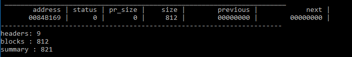
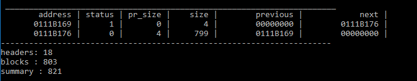
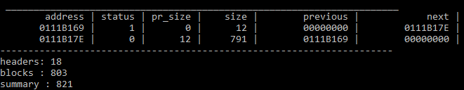
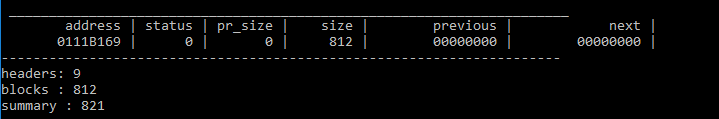

# allocator
### Header description
- Status : bool, 1 byte
- Previous_size : size_t, 4 bytes
- Size : size_t, 4 bytes

### Algorithm description
#### `void* mem_alloc(size_t size)` function
The function searches the best free memory area for the new block. It iterates over all memory area to find such area that has the smallest possible size that satisfying the `size` criteria. The found area must be split in two blocks if it has more size than needed. If no matching areas are found then the function returns `nullptr`, else the address of the new block.
#### `void* mem_realloc(void* addr, size_t size)` function
The function resizes the block. If `size` is equal to the block size, return the same address. If the block size is larger than `size`, then put a new header on `addr` + `size` + `HEADER_SIZE`, set it's size equal to the block size - `size` - `HEADER_SIZE` and the previous block size equal to `size`. The rest of the block combines with the next block if it exists. If the current block size is not enough, the algorithm checks the size of the next block. If `current_block_size` + `next_block size` >= `size`, then put a new header on `addr` + `size` + `HEADER_SIZE`, set it's size equal to `current_block_size` + `next_block_size` - `size` and the previous block size equal to `size`. Thus we take some memory from the next block and put a new block's header on unoccupied memory, creating a new block. If `current_block_size` + `next_block size` + `HEADER_T` >= `size`, then set size of the current block equal to `current_block_size` + `next_block_size`. If all the conditions are failed, then the function calls the `mem_alloc(size)` function since we cannot expand our block to the next one. In case of success, the old block must be freed, else the function returns `addr`.
#### `void mem_free(void* addr)` function
The function frees the memory of the block and gives it to the next block or the previous one if they're not busy and exist.
## Use
#### Create a block with default size - 812 bytes of memory + HEADER_SIZE
##### Code
```  
PTR = block(SIZE);  
```

#### Allocate 4 bytes of memory
##### Code
```
void* x1 = mem_alloc(4);
```

#### Realloc 4 bytes of memory to 12 bytes of memory
##### Code
```
void* x1 = mem_alloc(4);
mem_realloc(x1, 12);
```

#### Free 12 byte of memory
##### Code
```
void* x1 = mem_alloc(4);
mem_realloc(x1, 12);
mem_free(x1);
```

